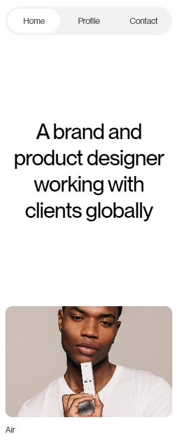
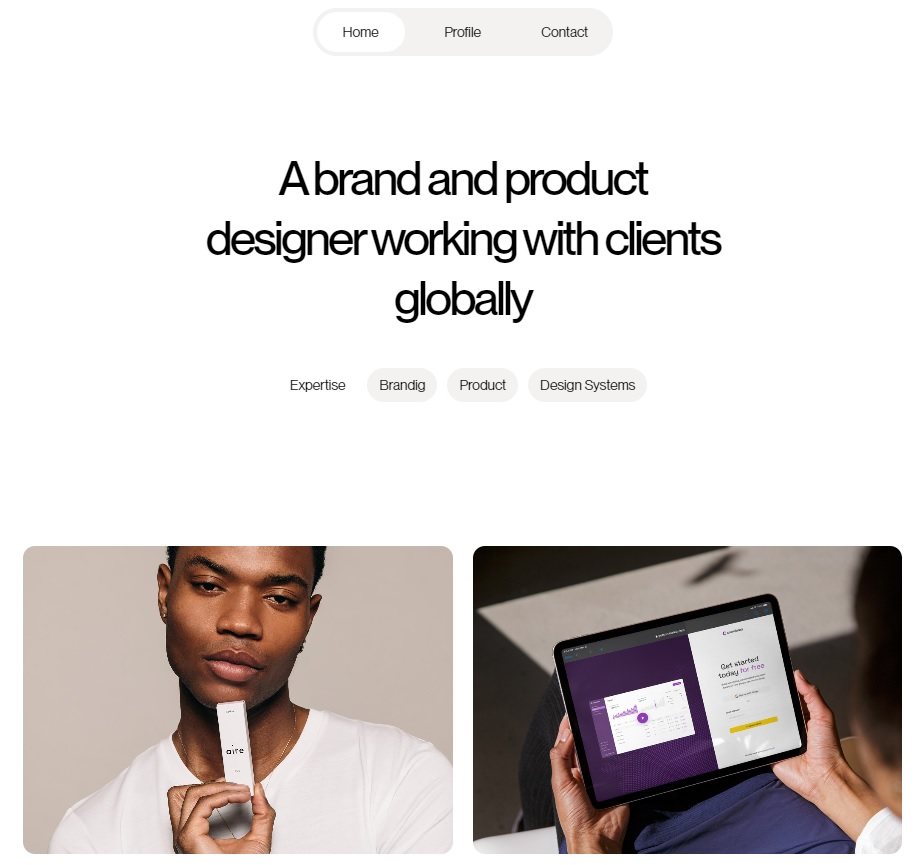

# OH STUDIO! Projects - Frontend Practice

## Table of contents

- [Overview](#overview)
  - [The challenge](#the-challenge)
  - [Screenshot](#screenshot)
  - [Links](#links)
- [My process](#my-process)
  - [Built with](#built-with)
  - [Resources](#resources)
- [Author](#author)

## Overview

### The challenge

Oh Studio is a project taken from the Frontend Practice platform where we can find different levels of projects to practice everything related to frontend development.
Oh Studio is a fictitious site that refers to a design studio, in which we can find 3 sections, a grid of images linked to different aspects of the company and a contact link.
### Screenshot

### Links

- Solution URL: [GitHub](https://github.com/Pablo-Zallio-Dev/oh-studio)
- Live Site URL: [Netlify](https://oh-studio-landing.netlify.app/)

## My process

### Built with

- Mobile-first workflow
- Semantic HTML5 markup
- CSS custom properties
- Flexbox
- Grid
- JavaScript Vanilla

### Resources

- Frontend Prectice - [Web Site](https://www.frontendpractice.com/)
- AOS (Animate on Scroll) - [Web Site](https://michalsnik.github.io/aos/)

## Author

- Linkedin - [Pablo Zallio](https://www.linkedin.com/in/pablo-damian-zallio-zabala-140b83278/)
- GitHub - [Pablo-Zallio-Dev](https://github.com/Pablo-Zallio-Dev)
- Frontend Mentor - [@Pablo-Zallop-Dev](https://www.frontendmentor.io/profile/Pablo-Zallio-Dev)

